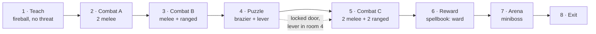

# Level — grid conventions, layout, population

Masterplan tasks 5.1.1, 5.2.1, 5.3.1. The grid rules are the part that
matters longest: they are what makes the alpha's handcrafted level a
procgen-ready kit at beta (ADR 0003).

---

## 1. Grid conventions

**These are not negotiable per-room.** Break them and the beta procgen work
starts from zero.

| Rule | Value |
|---|---|
| Grid cell | **4m × 4m** |
| Ceiling height | 3.5m standard, 6m in the arena |
| Corridor width | 3m (one cell, 0.5m margin each side) |
| Door socket width | 3m, centred on a cell edge |
| Door socket height | 3m |
| Room footprint | always a whole number of cells |

**Door sockets sit at the midpoint of a cell edge**, never at a corner,
never off-grid. A room is connectable if and only if its sockets land on
cell-edge midpoints. This single rule is what lets rooms be shuffled later.

### Kit pieces (5.1.1)

| Piece | Footprint | Sockets |
|---|---|---|
| Corridor | 1×3 cells | 2, opposite ends |
| Corner | 2×2 cells | 2, adjacent edges |
| Small room | 3×3 cells | up to 4, one per edge |
| Large room | 4×5 cells | up to 4, one per edge |

The miniboss arena is a one-off, not a kit piece — 5×5 cells (20m) with a
6m ceiling and four pillars.

### Scale is a gameplay value

Room dimensions are decided here rather than at the art pass because they
*are* mechanics:

- The arena is 20m because the miniboss moves at 3.6m/s and the player
  needs room to disengage mid-cast.
- Corridors are 3m so an earth wall (4m wide) **fully blocks one** — that
  is the spell's tactical purpose, and it fails if corridors are 5m.
- Ranged enemies prefer 8m, so any room meant to host them must have at
  least 10m of sightline or they will crowd uselessly.

---

## 2. Layout (5.2.1)

Eight rooms. Entry teaches, the middle escalates, the arena pays off.

Linear on purpose. A branching layout at alpha adds navigation confusion to
a playtest whose questions are all about casting.

### Room by room

**1 · Teach.** No enemies. A prompt, a lit brazier target, and the fireball
pattern displayed on the wall. The player cannot leave until they have cast
once. This is masterplan 5.3.4 and it is the only onboarding in the game.

**2 · Combat A.** Two melee, spawned in sequence rather than together. The
first enemy a player ever fights should let them finish a cast.

**3 · Combat B.** One melee fronting one ranged — the synergy pair, and the
first time positioning matters. Include one pillar so the ranged enemy can
be broken line-of-sight on; this teaches the earth wall's purpose before
the player is punished for not knowing it.

**4 · Puzzle.** An unlit brazier gates a locked door. **Any offensive spell
lights it**, and a lever in the same room opens the door regardless.
Two solutions because a single-spell gate hard-locks exactly the player
whose pattern for that spell is not landing.

**5 · Combat C.** Two melee, two ranged, in a large room with cover. The
difficulty peak before the reward.

**6 · Reward.** The spellbook: **Ward**. Picking it up shows the hexagon
pattern full-screen until dismissed. Ward is withheld rather than earth
wall because earth wall is the puzzle-adjacent utility and rooms 3 and 5
are built to teach it.

**7 · Arena.** 20m, four pillars, door locks on entry. The pillars exist so
the player can break line of sight mid-cast; without them the fight is a
damage race the drawing mechanic cannot win.

**8 · Exit.** Door → end screen with run stats.

### Difficulty ramp

| Room | Enemies | Cumulative DPS if the player stands still |
|---|---|---|
| 2 | 2 melee (sequential) | 10 |
| 3 | 1 melee + 1 ranged | 12.8 |
| 5 | 2 melee + 2 ranged | 25.6 |
| 7 | miniboss | 15.7 |

The miniboss is *lower* sustained DPS than room 5 by design — it is a
longer fight, so the pressure has to be survivable. Room 5 is the spike.

---

## 3. Population rules (5.3.1)

- **Melee front, ranged behind.** Never spawn a ranged enemy where the
  player meets it first; the pair only reads as a pair from the right angle.
- **Spawn on line-of-sight, not on room entry.** An enemy that aggros
  through a wall feels broken and gives the player no read.
- **Nothing spawns behind the player.** At alpha there is no reason for it
  and it makes every death feel unearned.
- **Health pickups after rooms 3, 5 and 7** — after the hard fight, not
  before it, so they read as recovery rather than as preparation.

## 4. Softlock checklist

The earth wall is player-spawned geometry, which makes it the most likely
softlock in the game. Verify all of these deliberately (they will not turn
up in normal play):

- [ ] Wall cast in a doorway does not seal the player out of the next room
- [ ] Wall cast in the puzzle room does not block the lever or the brazier
- [ ] Wall cast against the arena door while it is locked does not trap the
      player in a corner with the miniboss
- [ ] Two walls cast in the same corridor still despawn on their timer
- [ ] A wall cast at the exit door does not block the win state
- [ ] The lever remains reachable with two walls live in the puzzle room

The instance cap (max 2 live) and the 12s lifetime exist because of this
list. Do not raise the cap without re-running it.
